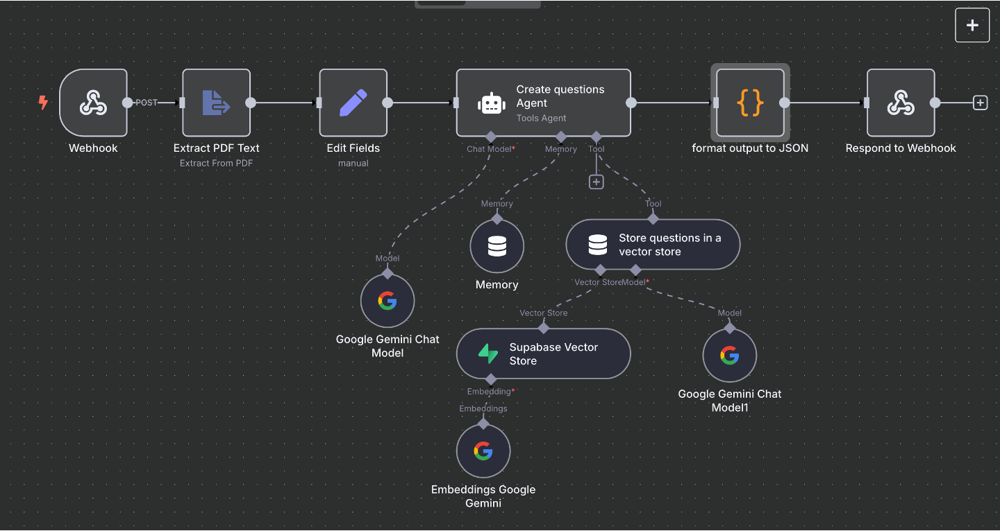
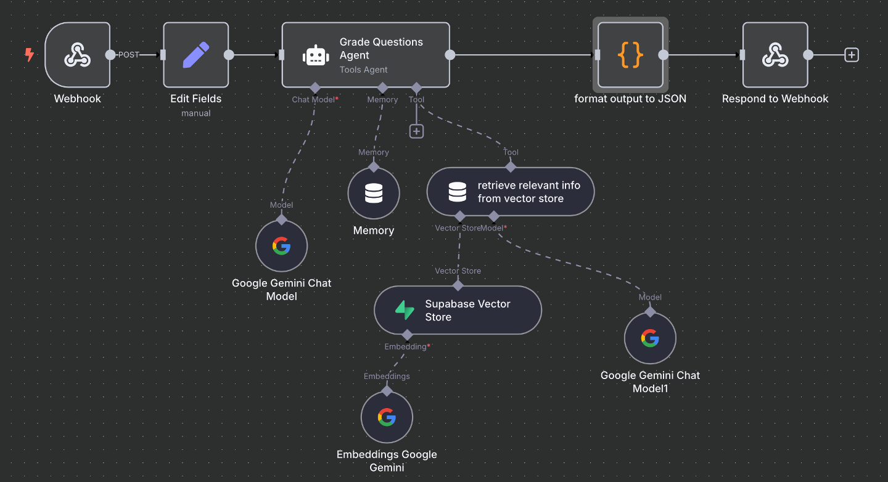

# 🧠 SIR - AI-Powered Quiz Platform

**SIR** is an intelligent quiz application designed to revolutionize the educational process for both teachers and students. By leveraging powerful AI agents, SIR automates the creation of quizzes from PDF materials and provides instant, insightful grading for essay questions, streamlining the entire assessment lifecycle.


## 💪 My Role in SIR

My primary role in the SIR project was focused on the development and implementation of its core AI functionalities. My contributions included:

* **AI Prototyping:** Prototyping the two main AI agents (**Question Generation** and **Automated Grading**) using **n8n** to validate the logic and workflow.

* **AI Agent Development:** Implementing the refined agents in Python using the **Pydantic-AI** framework to ensure structured and reliable outputs from Google's **Gemini API**.

* **Deployment:** Building and deploying the AI engine as a **FastAPI** service on **Vercel** to serve the mobile application.

## 🚀 SIR Features

### 👩‍🏫 Teacher-Specific Features

* **📚 Class Management:** Create classes, generate unique invite codes, and manage student enrollment.

* **📝 AI Quiz Generation:** Automatically create quizzes by simply uploading a PDF. Specify the number of multiple-choice and essay questions.

* **🔍 Quiz Review & Publishing:** Review AI-generated questions, set marks for each, and publish quizzes to specific classes.

* **🎛️ Quiz Control:** Activate/deactivate quizzes, show/hide results for students, and view detailed submission results.

* **📬 Request Management:** Approve or deny student requests to join classes.

### 👨‍🎓 Student-Specific Features


* **✍️ Intuitive Quiz Interface:** Attempt quizzes one question at a time with a clear timer and progress indicator.


* **📈 Instant AI-Graded Results:** Upon submission, view results including total marks, correct/wrong answers, and detailed feedback on essay questions.

* **📖 Answer Review:** Compare your answers with the model answers provided by the AI.

* **🚪 Join Classes:** Easily join classes using an invite code provided by the teacher.

## 📦 Repositories

* **📱 Mobile App (React Native):** [Link to Mobile App Repository](https://github.com/Selvster/sir)

* **🌐 Backend (Laravel):** [Link to Backend Repository](https://github.com/Selvster/sir-api)

## 🏰 AI Tech Stack & Deployment

The AI portion of this project was built using the following technologies:

* **🤖 AI Prototyping:** n8n

* **🧠 AI Services:** Pydantic-AI, Google Gemini API

* **⚙️ API Server:** FastAPI

* **☁️ Deployment:** Vercel

The live AI service is deployed on Vercel and can be accessed [here](https://vercel.com/adelshoushas-projects/sir).

## 🗂️ Project Resources

All project-related materials, including the demo video, screenshots, official documents, and presentations, can be found in the [`Project_Resources/`](Project_Resources/) folder.

### 📂 Folder Contents:

* 🎥 **Demo Video** (`SIR_Demo.mp4`)

* 📸 **App Screenshots** (`screenshots/`)

* 📖 **Project Book** (`SIR_Project_Book.pdf`)

* 📜 **Brochure** (`SIR_Brochure.pdf`)

* 🖼️ **Project Banner** (`SIR_Banner.pdf`)

* 🆔 **Project ID Card** (`SIR_ID.jpeg`)

* 📊 **Presentation Slides** (`SIR_Slides.pptx`)

## 📸 Screenshots & Demo

### 🚀 **Demo Video**


<div align="center">
    
  

https://github.com/user-attachments/assets/ea1669a2-0760-44a3-ade7-b820ee530815


  
</div>

### 🎤 **Project Presentation**

<div align="center">
    
  <a href="https://www.youtube.com/embed/L2MjEZ3Lvxc?start=381&end=555">
    
  </a>
  
</div>


### 🎨 **App Screenshots**

| Quiz Creation Form | Essay Questions | MCQ Questions |Result Page|  
| :---: | :---: | :---: | :---: |
| |  |  | |

| Classes Dashboard | Role Selection Screen | Registration Form | Profile Page |  
| :---: | :---: | :---: | :---: |
|  |  | |  |


### 📜 **Brochure & Banner Preview**

<table width="100%">
  <tr>
    <td align="center" width="70%">
      
    </td>
    <td align="center" width="30%">
      
    </td>
  </tr>
  <tr>
    <td align="center" width="70%">
      
    </td>
    <td align="center" width="30%">
      
    </td>
  </tr>
</table>


## 🧠 AI System Architecture

The AI engine of SIR is powered by two distinct agents. These were first prototyped in **n8n** and then implemented in Python with **Pydantic-AI** and **Google's Gemini model**, served via a **FastAPI** application.

### 1. AI-Powered Quiz Generation

This workflow is triggered when a teacher creates a new quiz. The process begins with a PDF upload and concludes with a set of structured questions ready for review.



1.  **PDF Upload**: The teacher uploads a PDF document through the React Native mobile app.
2.  **API Request**: The mobile app sends the PDF file and question counts to the `/create_questions` endpoint.
3.  **Agent Invocation**: The FastAPI server extracts the text and passes it to the **Question Generation Agent**.
4.  **LLM Processing**: The agent uses the **Gemini API** to generate MCQs and essay questions from the text.
5.  **Response to App**: The server returns the structured JSON questions to the mobile app.

### 2. AI-Powered Essay Grading

This workflow is triggered when a student submits a completed quiz.



1.  **Submit Quiz**: The student submits their answers through the mobile app.
2.  **API Request**: The app sends the student's essay answers to the `/grade_questions` endpoint.
3.  **Agent Invocation**: The data is passed to the **Question Grading Agent**, which uses a detailed rubric in its prompt.
4.  **LLM Processing**: The agent sends the question, model answer, and student's answer to the **Gemini API** for evaluation.
5.  **Response to App**: The agent returns a score and constructive feedback for each question back to the student's results page.


## 🔧 Installation & Running the AI Service

To run the AI backend service locally, follow these steps.

### Step 1: Navigate to the Deployment Folder

```
cd deployment
```

### Step 2: Create and Activate a Virtual Environment

#### On Windows:

```
python -m venv venv
.\venv\Scripts\activate
```

#### On Linux/MacOS:

```
python3 -m venv venv
source venv/bin/activate
```

### Step 3: Install Dependencies

Install all the required Python packages from the `requirements.txt` file.

```
pip install -r requirements.txt
```

### Step 4: Set Up Environment Variables

1. Navigate into the `api` directory.

   ```
   cd api
   ```

2. Create a file named `.env`.

3. Add your Google Gemini API key to the `.env` file:

   ```
   GEMINI_API_KEY="YOUR_API_KEY_HERE"
   ```

### Step 5: Run the FastAPI Server

While inside the `deployment/api` directory, run the following command to start the local server:

```
uvicorn main:app --reload
```

The AI service will now be running on `http://127.0.0.1:8000`. You can access the auto-generated API documentation at `http://127.0.0.1:8000/docs`.

## 🔗 LinkedIn Post
Check out the **LinkedIn post** about the SIR project here:
[SIR Project on LinkedIn]() 🚀
