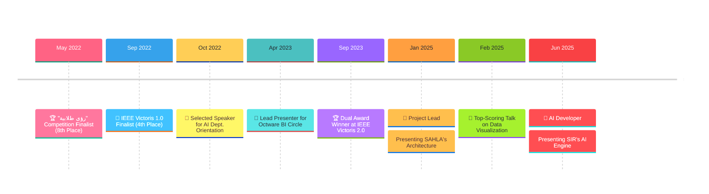

## 🎤 Public Speaking & Presentations

  🏆 "رؤى طلابية" Competition Finalist (8th Place) (May 2022)

 
  
* **Event:** "رؤى طلابية" (Student Visions) Competition - Mansoura University
* **Achievement:** 8th Place Finish (As the youngest first-year participant)
* **Audience:** Panel of university professors, the dean, and student competitors

### The Core Idea
I proposed a new strategy to accelerate electric car adoption in Egypt by creating a government-subsidized battery swapping network, addressing consumer concerns about charging time and range anxiety.

### Accomplishment
I developed and presented this strategy to a panel of university deans and professors. Competing against senior students from all engineering departments, I successfully secured a top-10 finish, demonstrating strong research and public speaking skills under pressure. This achievement was recognized with a certificate from the Dean of Engineering.

### Media Gallery
* [🎬 Watch the Final Presentation](https://your-video-link-here)
* [📊 View the Slide Deck](https://your-slides-link-here)

#### 📸 See Photo of the talk
| Presentation Highlights | Receiving the Certificate | Certificate of Achievement |
| :---: | :---: | :---: |
|  |  |  |

#### 🎬 **Watch the Final Presentation**

  <a href="https://www.youtube.com/embed/L2MjEZ3Lvxc?start=381&end=555">
    
  </a>

---

  <strong>🏅 IEEE Victoris 1.0 Finalist (4th Place)</strong> (September 2022)

 

* **Event:** IEEE Victoris 1.0 Competition
* **Achievement:** 4th Place Finish
* **Audience:** Panel of 3 industry judges and an audience of 200-300 students & professors

#### The Core Idea
Our team designed and presented "Manga Recipes," a mobile application dedicated to improving eating habits. The app helps users find new recipes by searching with various filters like ingredients on hand, dietary restrictions, preparation time, and calorie count. It also allows users to save favorites and contribute their own recipes to the platform.

#### Accomplishment
As the opening speaker for my team, I had the responsibility of being the very first presenter of the day. I introduced our mobile app's concept, features, and implementation to the judges and a large audience. Our team's clear vision and solid execution earned us 4th place in a competitive field.

#### Media Gallery
* [🎬 Watch the Q&A with Judges](https://your-video-link-here)
* [📊 View the Slide Deck](https://your-slides-link-here)
* [📸 See Team Photos](https://your-photos-link-here)

---

  <strong>🎤 Selected Speaker for AI Dept. Orientation</strong> (October 2022)

 

* **Event:** Artificial Intelligence Engineering Department Orientation Day
* **Achievement:** Honored by the Head of the Department for my contribution
* **Audience:** 150-200 new students, department faculty, and the University Dean

#### The Core Idea
My presentation served as a foundational introduction to Artificial Intelligence for incoming students. I explained the core concepts of AI, Machine Learning (ML), Neural Networks (NN), and Deep Learning (DL), focusing on how these fields relate to and build upon one another.

#### Accomplishment
As a featured student speaker, I had the privilege of welcoming the new cohort to the AI Engineering department. Presenting to an audience that included both fresh students and esteemed faculty like the University Dean, I successfully broke down complex topics into an accessible and engaging overview. Following the presentation, I was formally honored by the Head of the Department for my contribution to the orientation day.

#### Media Gallery
* [🎬 Watch a Clip of the Presentation](https://your-video-link-here)
* [📊 View the Slide Deck](https://your-slides-link-here)
* [📸 See Photos of the Talk & Ceremony](https://your-photos-link-here)

---

  <strong>🐙 Lead Presenter for Octware BI Circle</strong> (April 2023)

 

* **Event:** Octware Student Activity Orientation Day
* **Achievement:** Presented as the Head of the Business Intelligence (BI) Circle
* **Audience:** Approximately 50 new members from various engineering and computer science departments

#### The Core Idea
My presentation provided a comprehensive introduction to the field of Business Intelligence. I outlined the core principles of BI, explained its importance in the industry, and walked through the essential tools and technologies that our team members would be using.

#### Accomplishment
In my capacity as the Head of the BI Circle for the Octware student activity team, I was responsible for welcoming and educating the new recruits. My goal was to give them a clear roadmap of what they would learn and achieve in the BI circle. This talk set the foundation for their journey within the team and established my role as a leader and mentor.

#### Media Gallery
* [🎬 Watch the Presentation](https://your-video-link-here)
* [📊 View the Slide Deck](https://your-slides-link-here)
* [📸 See Event Photos](https://your-photos-link-here)

---

  <strong>🏆 Dual Award Winner at IEEE Victoris 2.0</strong> (September 2023)

 

* **Event:** IEEE Victoris 2.0 Competition
* **Achievement:** 4th Place Finish & "Best UI" Award by PUIUX
* **Audience:** Panel of 3 industry judges and 50-80 students & professors

#### The Core Idea
Our team developed "BrainUp," a comprehensive educational platform consisting of a mobile app and website. The project's goal was to enhance the learning process by integrating powerful AI-driven features into a seamless user experience.

#### Accomplishment
As the opening presenter for my team, I introduced our "BrainUp" platform to the panel of industry judges. Our project was highly praised for both its technical implementation and its user-centric design. We successfully secured 4th place overall and were also honored with the special "Best UI" award from PUIUX, recognizing our platform as having the most outstanding user interface in the competition.

#### Media Gallery
* [🎬 Watch the Q&A with Judges](https://your-video-link-here)
* [📊 View the Slide Deck](https://your-slides-link-here)
* [📸 See Team Photos](https://your-photos-link-here)

---

  <strong>🚀 Project Lead: Presenting SAHLA's Architecture</strong> (January 2025)

 

* **Event:** Project 1 Final Discussion
* **Achievement:** Presented as Project Lead and System Architect
* **Audience:** Panel of 3 professors and fellow students

#### The Core Idea
SAHLA (Speech And Hearing Language Assistant) is a mobile application designed to facilitate communication for non-hearing and non-speaking individuals. It provides a real-time solution that transforms Arabic Sign Language (ArSL) into text and speech, and vice versa, to create a more inclusive world.

#### Accomplishment
As the Project Lead, I was responsible for the overall technical vision of SAHLA, including designing the system architecture and developing the core machine learning models. During our project discussion, I presented the complete system architecture to the panel of professors, detailing the workflow between the React Native app, the Python backend, and various cloud services like Google Speech/Text APIs. My presentation demonstrated the technical foundation of the project and my central role in its creation.

#### Media Gallery
* [🎬 Watch the Presentation](https://your-video-link-here)
* [📊 View the Slide Deck](https://your-slides-link-here)
* [📸 See Event Photos](https://your-photos-link-here)
* [👨‍💻 Explore the GitHub Repo](https://your-repo-link-here)
* [💼 Read the LinkedIn Post](https://your-linkedin-post-link-here)

---

  <strong>💯 Top-Scoring Talk on Data Visualization</strong> (February 2025)

 

* **Event:** Deep Learning Course Presentation
* **Achievement:** Achieved Full Marks
* **Audience:** Course TA and fellow students

#### The Core Idea
My presentation focused on the critical role of data visualization in deep learning and provided a practical, hands-on guide to creating insightful plots using the Matplotlib library in Python.

#### Accomplishment
As a requirement for our Deep Learning course, I developed and delivered a presentation to my peers and the course TA. My clear explanation of the concepts and practical demonstration of Matplotlib's capabilities earned me the full mark for the assignment.

#### Media Gallery
* [🎬 Watch the Presentation](https://your-video-link-here)
* [📊 View the Slide Deck](https://your-slides-link-here)

---

  <strong>🧠 AI Developer: Presenting SIR's AI Engine</strong> (June 2025)

 

* **Event:** Project 2 Final Discussion
* **Achievement:** Presented the core AI agent architecture and implementation
* **Audience:** Panel of 3 professors and 20-30 fellow students

#### The Core Idea
SIR is an intelligent quiz application designed to revolutionize the educational process for both teachers and students. By leveraging powerful AI agents, SIR automates the creation of quizzes from PDF materials and provides instant, insightful grading for essay questions.

#### Accomplishment
My presentation focused on the heart of the SIR platform: the AI engine I developed. I explained the architecture of the AI agents responsible for quiz generation and automated grading, and detailed how we utilized frameworks like Pydantic-AI with the Gemini API. This talk showcased my direct contributions, from prototyping in n8n to deploying the final FastAPI service on Vercel.

#### Media Gallery
* [🎬 Watch the Presentation](https://your-video-link-here)
* [📊 View the Slide Deck](https://your-slides-link-here)
* [📸 See Event Photos](https://your-photos-link-here)
* [👨‍💻 Explore the Project Repos](https://your-repo-link-here)
* [💼 Read the LinkedIn Post](https://your-linkedin-post-link-here)

### 🎤 **Project Presentation**

    
  <a href="https://www.youtube.com/embed/L2MjEZ3Lvxc?start=381&end=555">
    
  </a>
  

